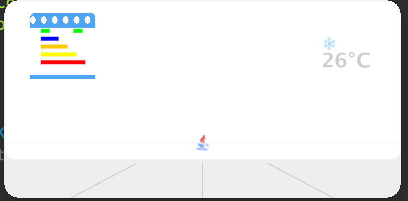

<h1 align="center">
Soul Air Conditioner 灵魂空调
</h1>

> 前世今生：为什么叫灵魂空调呢？有一天突然瞟到租的房间空调是三级能效，要知道在广东这个电1.5+一度的时代，这是一个多么让人痛心的一件事，

> 所以能不能做一个有意思的东西来安抚一下心灵。

于是在Github上找到了它 <https://github.com/YunYouJun/air-conditioner />

但是呢，它是一个网页程序，我还是得用宇宙第一语言Java来写一下，毕竟java才是天.

### 优势

- 📱 非常的便捷，能够用在所有可以运行Java的设备上
- 🔋 功耗极低，没有所谓的能耗之说
- 🔧 益于复制，只要可以使用Canvas 的编程语言都能复制出来

### 劣势

- 💨 它只能带来心灵上的安慰，肉体并不能带来感觉.

### 操作-试程序获取焦点，实在不行点击一下

- 按o键打开空调
- 按c键打开空调
- 按⬆️键调高温度
- 按⬇️键调低温度
- 按1键切换成制热
- 按0键切换成制冷

